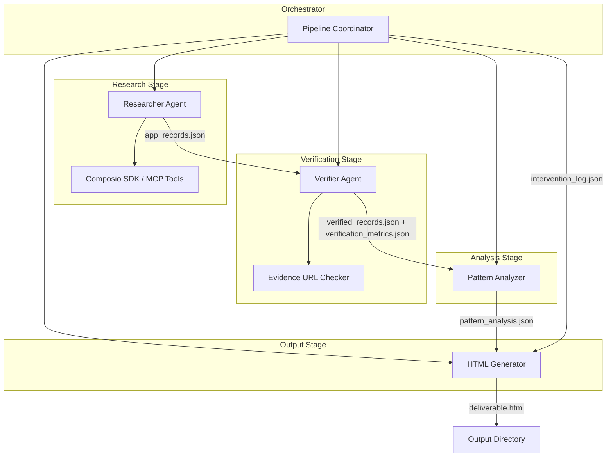
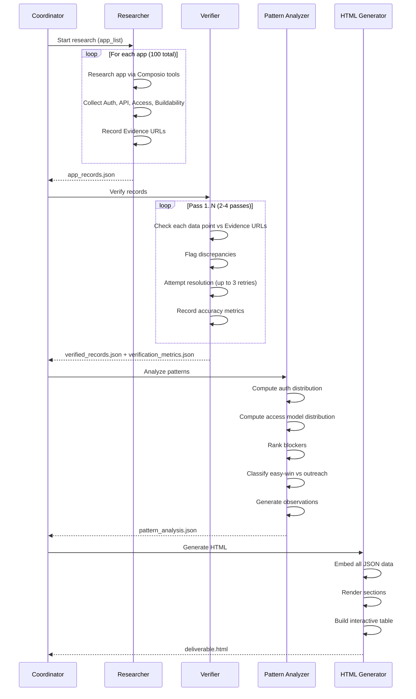

# Design Document: Composio App Research Pipeline

## Overview

This design describes an automated research pipeline and single-file HTML deliverable that analyzes 100 apps across 10 categories for Composio's AI tooling platform. The system is composed of four main pipeline stages—Researcher, Verifier, Pattern Analyzer, and HTML Generator—orchestrated by a coordinator that manages execution flow, error handling, and output assembly.

The pipeline is Python-based, using the `composio-core` SDK for tool access (web search, scraping) and LLM-driven research agents. The HTML deliverable is a self-contained file using Tailwind CSS (CDN embedded inline via a build step) with vanilla JavaScript for interactive filtering.

### Design Decisions

1. **Multi-agent architecture over monolithic script**: Each pipeline stage is an independent module with clear inputs/outputs. This allows individual stages to be retried, tested, and extended without coupling.
2. **JSON intermediate files over in-memory passing**: Each stage writes its output to a JSON file. This provides checkpointing (resume from last successful stage), auditability, and clean separation between pipeline stages and the HTML generator.
3. **Composio SDK as primary research tool**: Where Composio provides web search or scraping tools, the pipeline uses them. This dogfoods the platform and ensures research reflects real Composio capabilities.
4. **Single-file HTML with embedded data**: The HTML deliverable embeds all research data as a JSON blob inside a `<script>` tag. This avoids external requests and enables offline file:// usage.

## Architecture



### Pipeline Execution Flow



## Components and Interfaces

### 1. Pipeline Coordinator (`coordinator.py`)

The top-level orchestrator that manages stage execution, error handling, and checkpointing.

```python
class PipelineCoordinator:
    def __init__(self, app_list: list[str], output_dir: Path, config: PipelineConfig):
        """Initialize with target apps, output directory, and configuration."""

    async def run(self) -> PipelineResult:
        """Execute all pipeline stages in sequence. Returns final result with status."""

    async def run_stage(self, stage: PipelineStage) -> StageResult:
        """Execute a single stage with error handling and checkpointing."""

    def get_checkpoint(self) -> Optional[str]:
        """Return the last successfully completed stage name for resume."""
```

**Interface contracts:**
- Input: App list (100 app names with categories), pipeline config
- Output: `PipelineResult` with status, output directory path, and any errors
- Side effects: Writes JSON files to output directory, logs interventions

### 2. Researcher Agent (`researcher.py`)

Researches individual apps using Composio SDK tools for web search and scraping.

```python
class ResearcherAgent:
    def __init__(self, composio_client: ComposioClient, config: ResearchConfig):
        """Initialize with Composio SDK client and research configuration."""

    async def research_app(self, app_name: str, category: str) -> AppRecord:
        """Research a single app and return structured record."""

    async def research_batch(self, apps: list[AppInput]) -> list[AppRecord]:
        """Research all apps, handling failures gracefully."""

    async def _collect_auth_method(self, app_name: str, docs_url: str) -> AuthMethodResult:
        """Determine authentication method(s) from API documentation."""

    async def _assess_api_surface(self, app_name: str, docs_url: str) -> ApiSurfaceResult:
        """Assess API coverage, type, and MCP availability."""

    async def _assess_access_model(self, app_name: str, docs_url: str) -> AccessModelResult:
        """Determine if API access is self-serve or gated."""

    async def _determine_buildability(self, auth: AuthMethodResult, api: ApiSurfaceResult, access: AccessModelResult) -> BuildabilityResult:
        """Synthesize auth, API, and access findings into buildability verdict."""
```

**Composio SDK integration:**
- Uses `search_api` toolkit for web searches (finding API docs, developer portals)
- Uses `webscraper_io` or `scrapingbee` toolkit for extracting content from documentation pages
- Falls back to direct HTTP requests if Composio tools are unavailable

### 3. Verifier Agent (`verifier.py`)

Runs multi-pass verification over collected data, checking evidence URLs.

```python
class VerifierAgent:
    def __init__(self, composio_client: ComposioClient, config: VerificationConfig):
        """Initialize with Composio SDK client and verification configuration."""

    async def verify(self, records: list[AppRecord]) -> VerificationResult:
        """Run 2-4 verification passes over all records."""

    async def _run_pass(self, records: list[AppRecord], pass_number: int) -> PassResult:
        """Execute a single verification pass."""

    async def _check_evidence(self, data_point: DataPoint, evidence_url: str) -> EvidenceCheckResult:
        """Verify a single data point against its evidence URL."""

    async def _resolve_discrepancy(self, record: AppRecord, field: str, attempts: int) -> ResolutionResult:
        """Attempt to resolve a discrepancy by re-researching."""
```

### 4. Pattern Analyzer (`pattern_analyzer.py`)

Pure computation over verified records—no I/O or external dependencies.

```python
class PatternAnalyzer:
    def analyze(self, records: list[AppRecord]) -> PatternAnalysis:
        """Compute all pattern analysis from verified records."""

    def _compute_auth_distribution(self, records: list[AppRecord]) -> AuthDistribution:
        """Frequency distribution of auth methods per category and overall."""

    def _compute_access_distribution(self, records: list[AppRecord]) -> AccessDistribution:
        """Count self-serve vs gated per category."""

    def _rank_blockers(self, records: list[AppRecord]) -> list[BlockerRank]:
        """Rank blockers by frequency, return top 5+."""

    def _classify_apps(self, records: list[AppRecord]) -> AppClassification:
        """Classify apps as easy-win or requires-outreach."""

    def _generate_observations(self, records: list[AppRecord], auth_dist: AuthDistribution, access_dist: AccessDistribution, blockers: list[BlockerRank]) -> list[Observation]:
        """Generate 3+ data-backed observations."""
```

### 5. HTML Generator (`html_generator.py`)

Generates the single-file HTML deliverable from all pipeline outputs.

```python
class HtmlGenerator:
    def generate(self, data: HtmlInputData, output_path: Path) -> None:
        """Generate the self-contained HTML file."""

    def _render_executive_summary(self, data: HtmlInputData) -> str:
        """Generate 300-500 word executive summary."""

    def _render_data_table(self, records: list[AppRecord]) -> str:
        """Generate the interactive filterable table HTML."""

    def _render_pattern_section(self, patterns: PatternAnalysis) -> str:
        """Render pattern analysis with distributions and charts."""

    def _render_verification_section(self, metrics: VerificationMetrics) -> str:
        """Render verification audit results."""

    def _render_architecture_section(self, pipeline_stages: list[StageInfo]) -> str:
        """Render pipeline architecture documentation."""

    def _render_transparency_section(self, failures: list[FailureRecord], intervention_log: list[InterventionEntry]) -> str:
        """Render transparency section with failures and limitations."""

    def _embed_tailwind(self) -> str:
        """Return inline Tailwind CSS (CDN script for play CDN or pre-built)."""

    def _embed_javascript(self, records: list[AppRecord]) -> str:
        """Return filtering/interaction JavaScript with embedded data."""
```

## Data Models

### AppRecord

```python
from dataclasses import dataclass, field
from enum import Enum
from typing import Optional

class AuthMethod(str, Enum):
    OAUTH2 = "oauth2"
    API_KEY = "api_key"
    BASIC = "basic"
    TOKEN = "token"
    OTHER = "other"

class AccessModel(str, Enum):
    SELF_SERVE = "self_serve"
    GATED = "gated"

class ApiType(str, Enum):
    REST = "rest"
    GRAPHQL = "graphql"
    BOTH = "both"
    NONE = "none"

class ApiCoverage(str, Enum):
    FULL = "full"
    PARTIAL = "partial"
    MINIMAL = "minimal"

class BuildabilityVerdict(str, Enum):
    READY = "ready"
    FEASIBLE = "feasible"
    BLOCKED = "blocked"

class BlockerCategory(str, Enum):
    NO_PUBLIC_API = "no_public_api"
    INSUFFICIENT_COVERAGE = "insufficient_coverage"
    RESTRICTIVE_AUTH = "restrictive_auth"
    RATE_LIMITS = "rate_limits"
    MISSING_DOCUMENTATION = "missing_documentation"

class ResearchStatus(str, Enum):
    COMPLETE = "complete"
    PARTIAL = "partial"
    FAILED = "failed"
    UNRESEARCHABLE = "unresearchable"

@dataclass
class ApiSurface:
    has_public_api: bool
    api_type: Optional[ApiType]
    coverage: Optional[ApiCoverage]
    has_mcp_support: bool
    evidence_url: Optional[str]

@dataclass
class AppRecord:
    app_name: str
    category: str
    description: str  # max 120 chars
    auth_methods: list[AuthMethod]
    access_model: AccessModel
    api_surface: ApiSurface
    buildability_verdict: BuildabilityVerdict
    primary_blocker: Optional[BlockerCategory]
    evidence_urls: dict[str, str]  # field_name -> URL
    research_status: ResearchStatus
    missing_fields: list[str]
    failure_reason: Optional[str]
    failure_category: Optional[str]  # network_error, timeout, access_restriction, parsing_failure, agent_error
```

### PatternAnalysis

```python
@dataclass
class AuthDistribution:
    per_category: dict[str, dict[str, int]]  # category -> {auth_method: count}
    overall: dict[str, int]  # auth_method -> count
    dominant_per_category: dict[str, str]  # category -> most_common_auth

@dataclass
class AccessDistribution:
    per_category: dict[str, dict[str, int]]  # category -> {self_serve: N, gated: N}
    category_classification: dict[str, str]  # category -> "majority_self_serve" | "majority_gated"

@dataclass
class BlockerRank:
    blocker: str
    count: int
    rank: int

@dataclass
class Observation:
    title: str
    description: str
    supporting_data: str  # specific counts or percentages
    opportunity: str  # actionable recommendation

@dataclass
class PatternAnalysis:
    auth_distribution: AuthDistribution
    access_distribution: AccessDistribution
    blocker_rankings: list[BlockerRank]  # sorted by frequency, top 5+
    easy_win_apps: list[str]
    outreach_required_apps: list[str]
    observations: list[Observation]  # minimum 3
```

### VerificationMetrics

```python
@dataclass
class Discrepancy:
    app_name: str
    field_name: str
    original_value: str
    corrected_value: Optional[str]
    resolution_status: str  # "resolved", "unresolved", "partially_resolved"
    evidence_urls_checked: list[str]
    reason: Optional[str]

@dataclass
class PassMetrics:
    pass_number: int
    accuracy_percentage: float  # 0-100
    total_data_points: int
    confirmed_points: int
    discrepancies_found: int
    corrections_applied: int

@dataclass
class VerificationMetrics:
    passes_completed: int
    per_pass_metrics: list[PassMetrics]
    discrepancy_log: list[Discrepancy]
    overall_accuracy: float
    requires_manual_review: bool  # True if final accuracy < 80%
```

### InterventionLog

```python
@dataclass
class InterventionEntry:
    app_name: str
    pipeline_stage: str
    reason: str
    timestamp: str  # ISO 8601
    data_point: Optional[str]
```

### PipelineConfig

```python
@dataclass
class PipelineConfig:
    output_dir: Path
    max_retries: int = 3
    request_timeout_seconds: int = 30
    min_verification_passes: int = 2
    max_verification_passes: int = 4
    min_accuracy_threshold: float = 80.0
    composio_api_key: Optional[str] = None
    llm_model: str = "gpt-4o"
    concurrency_limit: int = 5
```

### Categories and App List

```python
CATEGORIES: list[str] = [
    "CRM & Sales",
    "Support & Helpdesk",
    "Communications & Messaging",
    "Marketing/Ads/Email/Social",
    "Ecommerce",
    "Data/SEO/Scraping",
    "Developer/Infra/Data",
    "Productivity & PM",
    "Finance & Fintech",
    "AI/Research/Media",
]

@dataclass
class AppInput:
    app_name: str
    category: str  # must be one of CATEGORIES
```

## Correctness Properties

*A property is a characteristic or behavior that should hold true across all valid executions of a system—essentially, a formal statement about what the system should do. Properties serve as the bridge between human-readable specifications and machine-verifiable correctness guarantees.*

### Property 1: Auth distribution sums to total app count

*For any* set of AppRecords, the sum of all auth method counts in the overall auth distribution SHALL equal the total number of auth method assignments across all records (accounting for apps with multiple auth methods), and the dominant auth method per category SHALL be the one with the highest count in that category.

**Validates: Requirements 4.1**

### Property 2: Access distribution partitions categories completely

*For any* set of AppRecords grouped by category, the sum of self-serve and gated counts per category SHALL equal the total number of apps in that category, and the category classification SHALL be "majority_self_serve" if and only if self_serve count > 50% of apps in that category.

**Validates: Requirements 4.2**

### Property 3: Blocker rankings are frequency-sorted

*For any* set of AppRecords with buildability verdicts that are not "ready," the blocker rankings SHALL be sorted in non-increasing order of count, SHALL include all distinct blockers present in the data, and SHALL report at least the top 5 if 5 or more distinct blockers exist.

**Validates: Requirements 4.3**

### Property 4: Easy-win classification is deterministic

*For any* AppRecord, the app is classified as "easy-win" if and only if its access_model is SELF_SERVE AND its api_surface.has_public_api is True AND its api_surface.api_type is REST or GRAPHQL or BOTH AND its buildability_verdict is READY. All other apps SHALL be classified as "requires-outreach." The union of easy-win and requires-outreach sets SHALL equal the full set of apps.

**Validates: Requirements 4.4**

### Property 5: Filter intersection correctness

*For any* combination of category, buildability, and auth_method filters applied to the app table, the displayed set SHALL equal the set intersection of individually applying each filter. That is: filter(category=X) ∩ filter(buildability=Y) ∩ filter(auth=Z) = filter(category=X, buildability=Y, auth=Z). The displayed row count SHALL match the cardinality of this intersection.

**Validates: Requirements 6.2, 6.3, 6.4, 6.6, 6.8**

### Property 6: App record JSON round-trip

*For any* valid AppRecord (including records with partial/failed/unknown fields), serializing to JSON and deserializing back SHALL produce an equivalent AppRecord with all fields preserved, no fields omitted, and the resulting JSON SHALL be independently parseable without referencing other files.

**Validates: Requirements 1.7, 8.6, 9.1, 9.7**

### Property 7: Verification accuracy metric consistency

*For any* verification pass result, the accuracy_percentage SHALL equal (confirmed_points / total_data_points) × 100, corrections_applied SHALL be less than or equal to discrepancies_found, and the requires_manual_review flag SHALL be True if and only if the final pass accuracy_percentage is below 80.

**Validates: Requirements 3.3, 3.6**

### Property 8: Category coverage invariant

*For any* pipeline execution result, the total number of app records (including failed and unresearchable) SHALL equal 100, distributed as exactly 10 per category across all 10 defined categories, and the reported total of successfully researched apps SHALL equal the sum of per-category successfully researched counts.

**Validates: Requirements 10.1, 10.2, 10.4**

### Property 9: Conditional field population invariants

*For any* AppRecord: (a) if buildability_verdict is not READY, then primary_blocker SHALL be non-None; (b) if api_surface.has_public_api is True, then api_type and coverage SHALL be non-None; (c) if research_status is FAILED or UNRESEARCHABLE, then failure_reason and failure_category SHALL be non-None.

**Validates: Requirements 1.5, 1.6, 8.1**

### Property 10: Partial research threshold

*For any* AppRecord with research_status PARTIAL, the app SHALL be counted as "successfully researched" if and only if the percentage of populated required fields is >= 80%. The missing_fields list SHALL accurately reflect which fields are not populated.

**Validates: Requirements 10.6, 1.7**

## Error Handling

### Retry Strategy

All external requests (web search, scraping, URL verification) use exponential backoff:

| Attempt | Delay | Max Wait |
|---------|-------|----------|
| 1       | 0s    | 30s timeout |
| 2       | 2s    | 30s timeout |
| 3       | 4s    | 30s timeout |
| Final   | Mark as failed | Record reason |

### Error Categories

```python
class PipelineError(Exception):
    """Base pipeline error."""
    category: str  # network_error, timeout, access_restriction, parsing_failure, agent_error

class NetworkError(PipelineError):
    category = "network_error"

class TimeoutError(PipelineError):
    category = "timeout"

class AccessRestrictionError(PipelineError):
    category = "access_restriction"

class ParsingError(PipelineError):
    category = "parsing_failure"

class AgentError(PipelineError):
    category = "agent_error"
```

### Failure Handling by Stage

**Researcher:**
- On failure after 3 retries: Mark app with `research_status = FAILED`, record `failure_reason` and `failure_category`, continue to next app
- On partial data: Mark `research_status = PARTIAL`, populate available fields, list missing fields
- Never fabricate data—missing is preferable to wrong

**Verifier:**
- On evidence URL inaccessible: Record as "unverified" with reason "evidence_url_inaccessible"
- On discrepancy after 3 resolution attempts: Mark as unresolved, document in discrepancy log
- If final accuracy < 80%: Set `requires_manual_review = True`

**Pattern Analyzer:**
- Pure computation, no external failures expected
- If input data is malformed: Raise descriptive error, abort stage

**HTML Generator:**
- If file write fails: Report which file failed and why
- If data is incomplete: Render with available data, show "N/A" for missing sections

### Intervention Logging

Any point where automation cannot proceed logs an `InterventionEntry`:
```python
{
    "app_name": "SomeApp",
    "pipeline_stage": "researcher",
    "reason": "API documentation requires authenticated access",
    "timestamp": "2024-01-15T10:30:00Z",
    "data_point": "api_surface"
}
```

## Testing Strategy

### Property-Based Testing

The pattern analysis module, data model validation, and filter logic are suitable for property-based testing because they involve pure functions with clear input/output behavior and universal properties that hold across a wide input space.

**Library**: [Hypothesis](https://hypothesis.readthedocs.io/) (Python)

**Configuration**: Minimum 100 iterations per property test.

**Tag format**: `Feature: composio-app-research-pipeline, Property {number}: {property_text}`

Each correctness property maps to a single property-based test:

| Property | Module Under Test | Generator Strategy |
|----------|-------------------|-------------------|
| 1: Auth distribution sums | `PatternAnalyzer._compute_auth_distribution` | Random lists of AppRecords with varied auth_methods |
| 2: Access distribution partitions | `PatternAnalyzer._compute_access_distribution` | Random AppRecords with random access_model per category |
| 3: Blocker rankings sorted | `PatternAnalyzer._rank_blockers` | Random AppRecords with random blocker assignments |
| 4: Easy-win classification | `PatternAnalyzer._classify_apps` | Random AppRecords covering all verdict/access/api combinations |
| 5: Filter intersection | `filter_apps()` JS logic (tested via Python port) | Random subsets + random filter combinations |
| 6: JSON round-trip | `AppRecord` serialization | Hypothesis `@given` with custom AppRecord strategy |
| 7: Accuracy metric consistency | `VerificationMetrics` computation | Random confirmed/total/discrepancy counts |
| 8: Category coverage | Pipeline output validation | Random records constrained to 10-per-category |
| 9: Conditional field population | `AppRecord` validation | Random records with varied statuses/verdicts |
| 10: Partial research threshold | Coverage counting logic | Random records with varied field population percentages |

### Unit Tests

Focus on specific examples and edge cases:

- **Researcher**: Mock Composio SDK responses, test parsing of specific documentation formats (OAuth2 page, API key docs, GraphQL schema detection)
- **Verifier**: Test specific discrepancy detection (value contradicts URL content), test max-retry behavior
- **HTML Generator**: Test HTML structure contains required sections (executive summary, architecture, verification, transparency), test badge rendering for each verdict/access value
- **Pattern Analyzer**: Test observation generation produces >= 3 observations with data references
- **Edge cases**: Empty filter result (contradictory filters), all apps failing research, single category with all gated apps, app with all fields unknown

### Integration Tests

- End-to-end pipeline with mocked external services (Composio SDK responses, web endpoint stubs)
- HTML deliverable opens in headless browser (Playwright), filters work, all sections render
- Output JSON files are independently parseable via `json.loads()`
- Pipeline resume from checkpoint produces consistent results
- Timeout and retry behavior with artificially slow mock responses

### Manual Verification

- Visual review of HTML deliverable in Chrome, Firefox, Safari, Edge
- Verify file:// protocol works with network disabled
- Spot-check 5-10 app records against actual public documentation
- Verify dark-mode aesthetics and badge readability
- Check interactive elements respond to user input (filter dropdowns, clear buttons)
